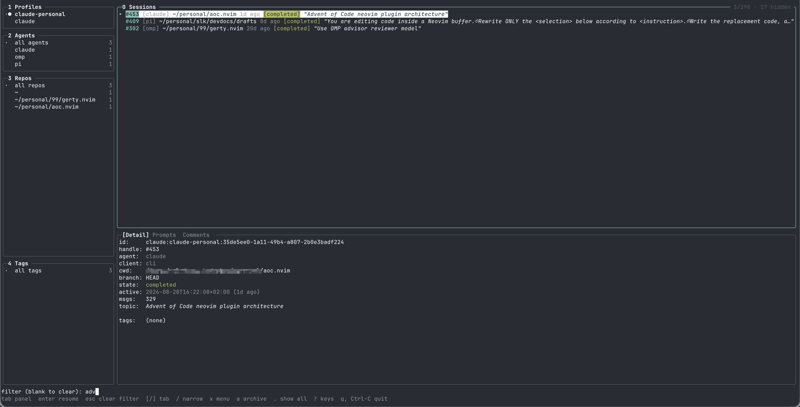

# lazyrecall

A terminal UI for every coding-agent session you have already had.



You have been pairing with Claude Code. And with pi, and omp, and hermes, sometimes all of them in the same week. Somewhere in there you fixed the flaky retry test, worked out why the migration deadlocks, and wrote the one prompt that finally got the refactor right.

Now find it again. Which agent was it? Which repo? Was that Tuesday or the Tuesday before? Every tool keeps its own history, in its own format, in its own directory, and not one of them has any idea what the other three were doing. So you scroll back through a terminal that no longer has it, or you just do the work twice.

lazyrecall reads what those agents already wrote to your disk and turns it into one list. Every session from every agent, newest first, with the repository it ran in, how it ended, and what it was about. Search the prompts you actually typed. Tag the good ones, leave yourself a comment on the one you will need in a month, and filter down by repo or agent until the list is short.

Then press enter, and you are back in that session - the same agent, the same working directory, right where you left off.

It does not run agents, watch anything, or send your sessions anywhere. It is a reader over files that are already on your disk. Resuming is the only thing that starts a process, and only because you asked it to.

## Install

lazyrecall needs no runtime dependencies: it is a single statically linked binary (`CGO_ENABLED=0`, pure-Go SQLite).

Via the install script (macOS and Linux):

```sh
curl -fsSL https://raw.githubusercontent.com/rfist/lazyrecall/main/install.sh | sh
```

Or build from source:

```sh
git clone https://github.com/rfist/lazyrecall.git
cd lazyrecall
CGO_ENABLED=0 go build -o lazyrecall ./cmd/lazyrecall
```

## Usage

`lazyrecall` with no arguments opens the interactive browser; the same interface is available as `lazyrecall browse`, which falls back to a plain listing when stdout is not a terminal.

```
lazyrecall                  open the interactive browser
lazyrecall list      [--agent=NAME] [--client=NAME] [--repo=PATH] [--tag=NAME] [--since=DAYS] [--json] [--profile=NAME]
lazyrecall search    QUERY [--agent=NAME] [--client=NAME] [--repo=PATH] [--tag=NAME] [--json] [--profile=NAME]
lazyrecall review    [--json] [--profile=NAME]
lazyrecall resume    [SESSION_ID] [--profile=NAME]
lazyrecall comment   add SESSION_ID TEXT... | list SESSION_ID | rm COMMENT_ID
lazyrecall tag       add SESSION_ID TAG | rm SESSION_ID TAG | list
lazyrecall archive   SESSION_ID | list
lazyrecall unarchive SESSION_ID
lazyrecall refresh   [--full] [--profile=NAME]
lazyrecall browse    [QUERY] [--agent=NAME] [--client=NAME] [--repo=PATH] [--tag=NAME] [--profile=NAME]
lazyrecall profiles  [--json]
lazyrecall config    path|init|show
lazyrecall version, --version, -v
```

A session held somewhere other than the agent's own terminal - a Neovim CodeCompanion chat, say, which reaches Claude Code over ACP - is listed as `[claude·acp]` and selected by `--client=acp`.

## Key bindings

| Key | Action |
| --- | --- |
| `1`-`4`, `0` | Jump to panel (`0` is Sessions) |
| `H` / `J` / `K` / `L` | Move focus to the panel in that screen direction |
| `tab` / `shift-tab` | Focus the next / previous panel |
| `j`/`k`, `↑`/`↓` | Move within the focused panel |
| `Ctrl-D` / `Ctrl-U` | Move by half a panel |
| `g` / `G` | First / last row |
| `enter` | Resume the selected session (Sessions); filter by the selected value (Agents, Repos, Tags); switch to the selected profile (Profiles) |
| `esc` | Clear what this panel is filtering by |
| `[` / `]` | Previous / next tab in the detail pane |
| `/` | Keep only the focused panel's rows containing what you type |
| `s` | Full-text search over your own prompts |
| `x` | Action menu for the focused panel |
| `X` | Clear all filters |
| `R` | Refresh the index |
| `m` / `M` | Add / remove a tag on the selected session |
| `c` / `C` | Add / remove a comment on the selected session |
| `?` | Show this list |
| `q`, `Ctrl-C` | Quit |

## Supported sources

| Agent | Where it stores sessions | Status |
| --- | --- | --- |
| `claude` (Claude Code) | `$CLAUDE_CONFIG_DIR/history.jsonl` plus transcripts under `projects/` | primary |
| `pi` | Transcripts under `~/.pi/agent/sessions/` | niche |
| `omp` | SQLite index at `~/.omp/agent/history.db`, transcripts under `~/.omp/agent/sessions/` | niche |
| `hermes` | SQLite at `~/.hermes/state.db` | niche |
| `goose` (Block's Goose) | SQLite at `~/.local/share/goose/sessions/sessions.db` | niche |
| `opencode` | SQLite at `~/.local/share/opencode/opencode.db` | niche |
| `antigravity` (Antigravity CLI, `agy`) | SQLite at `~/.gemini/antigravity-cli/conversation_summaries.db`; listing only, not full-text searchable - see note below | niche |

Plainly: if you use Claude Code, `claude` is the one you will actually have; the rest are niche tools most people will not have installed at all. Each source is a set of roots to scan plus an adapter; new sources are added via the `[sources]` config table (see [Configuration](#configuration)) and an adapter in the code.

`goose`, `opencode`, and `antigravity` keep everything in one SQLite database rather than per-session transcript files, the same shape `hermes` already used - so they need no transcript parser, just a query. `antigravity` is the exception worth knowing about: its per-conversation detail is stored as protobuf with no available schema to decode, so its sessions show up with a topic, working directory, and end time like everything else, but `s` (full-text prompt search) will never find anything inside them - only their title/preview, which `/` (the row filter) already covers.

## Configuration

Configuration is optional and lives at `~/.config/lazyrecall/config.toml` (`$LAZYRECALL_CONFIG` overrides the location; otherwise `$XDG_CONFIG_HOME/lazyrecall/config.toml` is used). With no file, lazyrecall runs on the defaults below.

| Key | Default |
| --- | --- |
| `default_profile` | (none; the program applies its own rule) |
| `sources.<agent>.roots` | `claude`: `["~/.claude-personal", "~/.claude"]`, `pi`: `["~/.pi"]`, `omp`: `["~/.omp"]`, `hermes`: `["~/.hermes"]`, `goose`: `["~/.local/share/goose/sessions"]`, `opencode`: `["~/.local/share/opencode"]`, `antigravity`: `["~/.gemini/antigravity-cli"]` |
| `sources.<agent>.resume` | `claude --resume {id}`, `pi --session {id}`, `omp --resume {id}`, `hermes --resume {id}`, `goose session --resume --session-id {id}`, `opencode --session {id}`, `agy --conversation {id}` |
| `sources.<agent>.env_var` | `claude`: `CLAUDE_CONFIG_DIR`; the rest: none |
| `sources.<agent>.single_install` | everything but `claude`: `true` |
| `hide.non_interactive` | `true` |
| `hide.min_messages` | `0` |
| `hide.paths` | `[]` |
| `browse.show_archived` | `false` |

`resume` is an argv template in which `{id}` is replaced with the session id; `env_var` names the environment variable set to the profile's root when resuming; `single_install` marks a source that has exactly one installation per machine and so cannot be split work/personal.

`lazyrecall config init` writes a commented-out copy of these defaults, and `lazyrecall config show` prints the effective config with each value's provenance (default, file, env, or flag).

Environment variables: `LAZYRECALL_CONFIG` (config file path), `LAZYRECALL_HOME` (data directory, default `~/.lazyrecall`), and `LAZYRECALL_PROFILE` (default profile).

## Profiles

Profiles isolate configuration roots from each other: each discovered root (for example a work and a personal Claude install) becomes its own profile with its own database. Work and personal data never mix in one listing.

## License

MIT — see [LICENSE](LICENSE).
